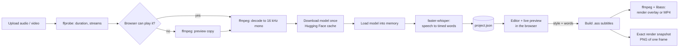

# Karaoke Captions

Word-by-word karaoke captions from any voice-over. Upload audio or video, let Whisper transcribe it with per-word timings, fix the transcript, style the captions over your footage or a template, and export a transparent overlay or a finished MP4.

Everything runs on your own computer. There are no accounts, no API keys and no per-minute charges. The speech-recognition model is open source and is downloaded once, then reused offline.

---

## Contents

- [Quick start](#quick-start)
- [The workflow at a glance](#the-workflow-at-a-glance)
- [1. Uploading and transcription options](#1-uploading-and-transcription-options)
  - [Which model should I choose?](#which-model-should-i-choose)
  - [Language](#language)
  - [Device: CPU or GPU](#device-cpu-or-gpu)
  - [Names and terms](#names-and-terms)
  - [Importing your own word timings](#importing-your-own-word-timings)
  - [Supported input files](#supported-input-files)
  - [The progress screen](#the-progress-screen)
- [2. Editing the transcript](#2-editing-the-transcript)
- [3. Previewing](#3-previewing)
- [4. Styling the captions](#4-styling-the-captions)
- [5. Exporting](#5-exporting)
- [Command-line tool](#command-line-tool)
- [How it works end to end](#how-it-works-end-to-end)
- [Tech stack](#tech-stack)
- [Project layout](#project-layout)
- [Where your data lives](#where-your-data-lives)
- [Configuration](#configuration)
- [Troubleshooting](#troubleshooting)

---

## Quick start

### Requirements

| Requirement | Why |
|---|---|
| **Python 3.10+** | Runs the app |
| **ffmpeg and ffprobe** on your `PATH` | Reads media, decodes audio, burns captions into video (needs a build with `libass`, which standard builds include) |
| *Optional:* NVIDIA GPU with CUDA 12, cuBLAS and cuDNN 9 | Much faster transcription. Without it everything still works on the CPU |

Install ffmpeg with `winget install Gyan.FFmpeg` (Windows), `brew install ffmpeg` (macOS) or your Linux package manager.

### Install and run

```powershell
git clone <this repo> karaoke-captions
cd karaoke-captions
python -m venv .venv
.\.venv\Scripts\activate          # macOS/Linux: source .venv/bin/activate
pip install -e .
karaoke-captions                  # or: python -m karaoke_captions
```

Your browser opens at <http://localhost:8000>. Stop the server with **Ctrl+C**.

Useful flags for `karaoke-captions serve`:

| Flag | Default | Meaning |
|---|---|---|
| `--port` | `8000` | Port for the web app |
| `--host` | `127.0.0.1` | Use `0.0.0.0` to reach it from other devices on your network |
| `--workspace` | `./workspace` | Folder for projects, fonts, templates and exports |
| `--no-browser` | off | Don't open a browser tab on start |

---

## The workflow at a glance

1. **Upload** an audio or video file and pick a model, language and device.
2. **Wait** while it's transcribed. Every step has its own progress bar.
3. **Edit** the transcript: fix words, timings and line breaks.
4. **Style** the captions: font, colors, highlight effect, box or outline, position.
5. **Preview** over your own video, a template video or a solid color.
6. **Export** a transparent overlay (`.mov` or `.webm`), a finished `.mp4`, subtitles (`.ass`) or the raw transcript (`words.json`).

Projects are saved automatically and listed under **Recent projects** on the home page.

---

## 1. Uploading and transcription options

### Which model should I choose?

The **Accuracy** dropdown picks the Whisper model. Bigger models are more accurate, especially for accents, noisy audio and non-English speech, but they're slower and take more disk space. Each model downloads once (first use only) and is reused after that.

| Model | Download | Speed | Accuracy | Choose it when |
|---|---|---|---|---|
| **Tiny** | ~75 MB | Fastest | Rough | Quick tests, checking timing, very clean English audio |
| **Base** | ~145 MB | Very fast | Fair | Clean English on a slow computer |
| **Small** *(default)* | ~480 MB | Fast | Good | Everyday English and major European languages on a CPU |
| **Medium** | ~1.5 GB | Moderate | Very good | Accents, background noise, when Small makes too many mistakes |
| **Large v3 Turbo** | ~1.6 GB | Fast for its size | Excellent | **Best all-rounder.** Recommended for Indian and other non-English languages (Hindi, Telugu, Tamil, Bengali…) |
| **Large v3** | ~3 GB | Slowest | Best | Difficult audio where every word matters and you can wait |

Rules of thumb:

- **English, clean voice-over:** Small.
- **Any Indian language, or mixed languages:** Large v3 Turbo, with the language set explicitly.
- **On a CPU without a GPU:** stay with Small or Large v3 Turbo; Large v3 can take longer than the audio itself.
- **Model gives garbled or repeated text:** move up a size. Small models struggle with less common languages.

> Speed varies a lot by computer. The app measures how long each model takes on your machine and uses that to estimate progress the next time.

### Language

| Option | When to use it |
|---|---|
| **Detect automatically** | Fine for English and widely spoken languages. Whisper listens to the first ~30 seconds and guesses. |
| **A specific language** | **Recommended whenever you know it.** Faster, and avoids wrong guesses. |

The language decides the **script** Whisper writes in. If Telugu speech is transcribed as Hindi, you get Telugu words spelled phonetically in Devanagari (for example *"नमस्कारम ना पेरू"* instead of *"నమస్కారం నా పేరు"*). If that happens, upload again with the correct language and a larger model.

The dropdown lists English, Hindi, Spanish, French, German, Portuguese, Italian, Dutch, Japanese, Korean, Chinese, Arabic, Russian, Tamil, Telugu and Bengali. Whisper itself supports about 99 languages; automatic detection can return any of them, and the command-line tool accepts any [Whisper language code](https://github.com/openai/whisper#available-models-and-languages) (for example `--language mr` for Marathi).

The form remembers your last choices, so check the language before each upload.

### Device: CPU or GPU

| Option | Behaviour |
|---|---|
| **Auto (GPU if available)** | Uses an NVIDIA GPU when one is detected, otherwise the CPU. Falls back to the CPU if the GPU libraries fail with an error. |
| **CPU** | Always works. Slower, but reliable. Uses 8-bit (`int8`) math to stay fast. |
| **NVIDIA GPU (CUDA)** | Fastest. Uses 16-bit (`float16`) math. Needs CUDA 12 plus the **cuBLAS** and **cuDNN 9** libraries. |

If transcription on the GPU sits at the "Transcribing" step with no words coming back, the NVIDIA libraries are probably missing; the step turns amber after a minute and suggests switching to CPU. To use the GPU, install the libraries into the virtual environment:

```powershell
pip install nvidia-cublas-cu12 nvidia-cudnn-cu12
```

On Windows their folders may also need to be on your `PATH`; see the [faster-whisper GPU notes](https://github.com/SYSTRAN/faster-whisper#gpu).

### Names and terms

Whisper doesn't know your brand or people's names. Type them here, comma separated, and they're passed to Whisper as a hint (its *initial prompt*):

```
Lyzr, Tatum Signal, Venkatesh
```

This noticeably improves the spelling of product names, acronyms and unusual words. Keep it short; it's a hint, not a dictionary.

### Importing your own word timings

Already have timings from another tool? Attach a `words.json` and transcription is skipped entirely:

```json
{
  "words": [
    { "text": "Hello",  "start": 0.00, "end": 0.42 },
    { "text": "world.", "start": 0.48, "end": 0.90 }
  ]
}
```

`word` is accepted instead of `text`, and a bare list (without the `"words"` wrapper) works too. Optional fields: `break_after: true` forces a new caption line after that word, and `prob` (0–1) marks confidence. Any `words.json` exported from this app can be imported again.

### Supported input files

| Input | Accepted | Notes |
|---|---|---|
| Voice-over / media | Any audio or video ffmpeg can read: WAV, MP3, M4A, AAC, OGG, OPUS, FLAC, MP4, MOV, MKV, WEBM… | Files the browser can't play (MOV, MKV, some audio) are converted to a small preview copy automatically. Vertical videos switch the canvas to 1080×1920. |
| Word timings | `.json` | See above |
| Fonts | `.ttf`, `.otf`, `.ttc` | Upload from the style panel |
| Template videos | Any video ffmpeg can read | Used as a looping background for previews and MP4 exports |
| Presets | `.json` exported from this app | Import from the Presets section |

### The progress screen

After uploading you see each step with its own 0–100% bar, a detail line and how long it took:

| Step | What happens | Progress is |
|---|---|---|
| Uploading file | The browser sends the file to the local server | Real (bytes sent) |
| Waiting in queue | Shown only if another transcription is running; one runs at a time | — |
| Reading media | `ffprobe` reads duration, streams and resolution | Real |
| Preparing preview | Converts the file for browser playback, only when needed | Real (ffmpeg time) |
| Decoding audio | ffmpeg converts the audio to 16 kHz mono for Whisper | Real |
| Downloading model | First use of a model only. Shows MB downloaded and speed | Real (bytes) |
| Loading model | Reads the model from disk into memory, once per server run | Estimated |
| Transcribing | Whisper converts speech to timed words | Real for longer files, estimated for short clips |

Estimated bars show a `~` before the percentage and a striped fill. If a step stops moving for much longer than expected, it turns amber with a hint (for example, to switch to CPU or check your internet connection). **Cancel** stops the job within a second, at any step.

You can leave the page while it works; the job continues in the background.

---

## 2. Editing the transcript

The transcript sits under the preview as lines of word "chips", grouped exactly as they'll appear on screen.

| Action | How |
|---|---|
| Jump to a word | Click it (playback seeks there) |
| Edit a word | Double-click, or select and press **Enter** / **F2** |
| Split a word | While editing, type a space; timing is shared out by length |
| Move between words | **←** / **→**, or **Tab** / **Shift+Tab** while editing |
| Force a new caption line | **B**, or **↵ Break** in the inspector |
| Merge with the next word | **M** |
| Delete | **Del** / **Backspace** |
| Insert a word | **+ Word** in the inspector |
| Play / pause | **Space** |
| Undo / redo | **Ctrl+Z** / **Ctrl+Shift+Z** (or **Ctrl+Y**) |
| Find | **Ctrl+F**; **Enter** / **Shift+Enter** for next / previous match |
| Replace all | Type in "Replace with" and press **Replace all** |

**Inspector.** Selecting a word opens a bar with its text, start and end times (type a value or nudge with − / +), **▶ Play** (plays just that word), Break, Merge, + Word and Delete.

**Review.** Words Whisper was less than 50% sure about get a wavy amber underline, and the inspector shows how sure it was. The **⚠ N to review** button jumps through them one by one; editing a word clears its warning.

**Follow.** When on, the transcript scrolls with playback.

**Playback speed.** 0.5× to 2× from the dropdown next to the timeline. The timeline also shows each caption line as a bar, so gaps are easy to spot.

Changes are saved automatically ("All changes saved" in the top bar).

---

## 3. Previewing

**Backgrounds** (chips above the preview):

| Background | Use it for |
|---|---|
| **Aurora gradient** | Built-in animated template, generated on first run |
| **Your template videos** | Click **+ Template video** to upload b-roll or brand footage; it loops behind the captions. Remove with × |
| **My video** | Appears when your upload has video; plays in sync with the audio |
| **Dark / Light / Green screen** | Check contrast, or preview for chroma keying |
| **Transparent** | Checkerboard, to judge how an overlay will look |

The background choice also becomes the default background when you export an MP4.

**Live preview vs Exact render.** The live preview is an HTML imitation of the final render so it can update instantly while you style. Turn on **Exact render** and, whenever playback is paused, the frame is replaced by a real render from the same engine the export uses (libass). Use it to double-check fonts, outlines and spacing before exporting.

---

## 4. Styling the captions

The right-hand panel. Every change shows in the preview immediately and is saved with the project.

### Presets

| Preset | Look |
|---|---|
| **Bold pop** | Short-form style: big capitals, yellow pop and slight zoom on the active word, centered, 3 words per line |
| **Classic outline** | Arial with a thin outline and drop shadow |
| **Darkbox** | Inter on a soft dark box with a purple active word |
| **Minimal** | No box, soft shadow; spoken words stay lit |
| **Neon fill** | Smooth karaoke sweep in cyan over a dark outline |

- **Save current** stores your style as a preset on this computer.
- **Export** downloads it as `caption-style.json` to share or use with the command-line tool.
- **Import** applies a preset file.

Presets don't change the canvas size or frame rate.

### Text

| Setting | Notes |
|---|---|
| **Font family** | Search installed fonts, or **+ Upload font** (`.ttf`, `.otf`, `.ttc`). A warning appears if the font isn't installed, because the export would fall back to a default font. **For Indian scripts, pick a font that contains them** (for example Noto Sans Telugu, Noto Sans Devanagari); Latin-only fonts like Inter will show empty boxes. |
| **Size** | 16–200 px, relative to the canvas size |
| **B / I / AA** | Bold, italic, ALL CAPS |
| **Letter spacing** | −5 to 30 px |

### Colors and highlight

| Setting | Notes |
|---|---|
| **Primary · text** | Colour and opacity of words not currently highlighted |
| **Secondary · active word** | Colour of the highlight |
| **Highlight style** | How the highlight moves (below) |
| **Active word size** | Enlarges the spoken word, 100–160% (not used by Smooth fill) |

| Highlight style | Effect | Good for |
|---|---|---|
| **Active word** | Only the word being spoken is highlighted | Social clips, talking heads |
| **Progressive** | Words stay highlighted once spoken, so the line "fills up" word by word | Reading along, tutorials |
| **Smooth fill** | Each word fills with colour left to right in time with the speech | Classic karaoke, music |

### Background

| Option | Settings |
|---|---|
| **Box** | Box colour and opacity, padding X/Y. Best legibility on busy footage |
| **Outline** | Outline colour and width. Clean look that works on most footage |
| **None** | Text only; pair with a shadow |
| *Any option* | Shadow colour, opacity and distance |

### Position & lines

| Setting | Notes |
|---|---|
| **Position** | Top, Middle or Bottom |
| **Distance from edge** | Gap from the top or bottom edge (hidden for Middle) |
| **Side margin** | Keeps text away from the left and right edges |
| **Max words per line** | 1–15. Use 2–4 for vertical short-form video, 6–8 for landscape |
| **Max characters per line** | Hard limit on line length; 0 = no limit |
| **New line after a pause of** | Starts a new line when the speaker pauses this long; 0 = off |
| **Keep line on screen after speech** | Holds the last line briefly instead of cutting it the instant speech ends |
| **New line after . ? !** | Starts a new line at the end of each sentence |

You can also force a break after any single word in the editor (**B**).

### Canvas

| Setting | Options |
|---|---|
| **Resolution** | 1920×1080 (16:9), 1080×1920 (9:16 vertical), 1080×1080 (1:1), 1080×1350 (4:5), 1280×720, 3840×2160 (4K), or custom |
| **Frame rate** | 24, 25, 30, 50 or 60 fps. Match your edit's frame rate |

---

## 5. Exporting

Click **Export** in the top bar.

| Format | What you get | Choose it when |
|---|---|---|
| **Transparent overlay · .mov (ProRes 4444)** | Captions only, with a real alpha channel | Editing in Premiere Pro, DaVinci Resolve or Final Cut. Highest quality, large files |
| **Transparent overlay · .webm (VP9 alpha)** | Captions only, with alpha, much smaller | OBS, After Effects, web players, or when file size matters |
| **Finished video · .mp4 (H.264)** | Captions burned onto a background, with your audio | Posting directly to social media or sharing |

Options:

- **Overlays:** *Include the audio track* (off by default, since the overlay usually sits on top of footage that already has audio).
- **MP4 background:** *My uploaded video*, *A template video* (loops for the whole duration) or *Solid color*.
- **MP4 framing** (video backgrounds): *Fill the frame (crop edges)* or *Fit inside (add bars)*.

A progress bar shows the render; it can be cancelled. Finished files appear under **Previous exports**, where you can download them again or delete them.

**Other downloads** (instant, no rendering):

- **Subtitles (.ass)** — Advanced SubStation Alpha file with all styling and karaoke timing. Works in VLC, mpv, Aegisub and many editors.
- **Transcript (words.json)** — Every word with start and end times. Import it later, or use it in your own scripts.

---

## Command-line tool

The same engine works without the browser.

```powershell
# Transcribe to words.json (prints step-by-step progress)
karaoke-captions transcribe voice.mp3 --model large-v3-turbo --language te --device cpu --prompt "Lyzr, Venkatesh"

# Render captions from words.json
karaoke-captions render voice.mp3 voice.words.json --format mov --preset caption-style.json
karaoke-captions render voice.mp3 voice.words.json --format mp4 --bg-color "#0B0F17" --set font_size=80 --set highlight_mode=fill
karaoke-captions render voice.mp3 voice.words.json --format ass      # subtitles only
```

| `transcribe` option | Meaning |
|---|---|
| `--model` | `tiny`, `base`, `small`, `medium`, `large-v3`, `large-v3-turbo` |
| `--language` | Any Whisper language code; empty = detect |
| `--device` | `auto`, `cpu`, `cuda` |
| `--prompt` | Names and terms hint |
| `--out` | Output path (default: `<audio>.words.json`) |

| `render` option | Meaning |
|---|---|
| `--format` | `mov`, `webm`, `mp4` or `ass` |
| `--preset` | Preset JSON exported from the web app |
| `--set KEY=VALUE` | Override any style field (repeatable), e.g. `--set highlight_color=#FACC15` |
| `--bg-color` | Background for MP4 when the input is audio only |
| `--audio-track` | Include the audio in transparent overlays |
| `--out` | Output path |

Style field names match the [style settings](#4-styling-the-captions); see `karaoke_captions/core/style.py` for the full list.

---

## How it works end to end



1. **Upload.** The browser sends the file to the local FastAPI server, which creates a project folder and starts a background job.
2. **Media preparation.** `ffprobe` reads the file. If the browser can't play the format, ffmpeg makes a lightweight preview copy (H.264 MP4 or AAC M4A).
3. **Audio decoding.** ffmpeg converts the audio to the 16 kHz mono floating-point samples Whisper expects, streamed so progress can be reported.
4. **Model.** On first use the model files are downloaded from Hugging Face into the shared cache (`~/.cache/huggingface/hub`). After that the cached copy is used, even offline. The loaded model stays in memory until the server stops, so later jobs skip loading.
5. **Transcription.** [faster-whisper](https://github.com/SYSTRAN/faster-whisper) runs Whisper with voice-activity detection (to skip silence) and word-level timestamps. Each word gets a start, an end and a confidence score. Transcription runs on a worker thread so progress keeps updating and Cancel works even if Whisper is busy.
6. **Editing and styling.** The browser loads the words and style, groups words into lines with the same rules the renderer uses (`core/layout.py`, mirrored in `static/js/layout.js`), and draws an HTML preview. Edits and style changes autosave to `project.json`.
7. **Subtitle generation.** On export, the words and style become an [ASS](https://en.wikipedia.org/wiki/SubStation_Alpha) subtitle file. Highlight styles become per-word colour changes; Smooth fill uses ASS karaoke timing (`\kf`).
8. **Rendering.** ffmpeg draws the ASS file with **libass** (the same subtitle engine as VLC and mpv) onto the chosen background. For transparent overlays the captions are rendered twice, once in colour and once in white as a coverage mask, and merged so semi-transparent boxes and soft edges keep correct alpha.
9. **Exact render** uses the same pipeline to produce a single PNG frame, so what you see when paused is exactly what the export produces.

Only one transcription runs at a time (others wait in the queue); renders can run alongside.

---

## Tech stack

| Layer | Technology | Role |
|---|---|---|
| Speech recognition | **[OpenAI Whisper](https://github.com/openai/whisper)** models via **[faster-whisper](https://github.com/SYSTRAN/faster-whisper)** | Speech to timed words |
| Inference engine | **[CTranslate2](https://github.com/OpenNMT/CTranslate2)** | Runs Whisper efficiently on CPU (int8) or NVIDIA GPU (float16) |
| Voice activity detection | **Silero VAD** (bundled with faster-whisper) | Skips silence |
| Model hosting | **[Hugging Face Hub](https://huggingface.co/Systran)** (`huggingface_hub`) | One-time model download and local cache |
| Backend | **Python 3.10+**, **[FastAPI](https://fastapi.tiangolo.com/)**, **[Uvicorn](https://www.uvicorn.org/)** | Local web server and REST API, background job threads |
| Media | **[ffmpeg / ffprobe](https://ffmpeg.org/)** with **[libass](https://github.com/libass/libass)** | Probing, decoding, preview conversion, caption rendering, encoding (ProRes 4444, VP9 alpha, H.264) |
| Subtitles | **ASS / SSA** format | Styling and karaoke timing |
| Fonts | **[fontTools](https://github.com/fonttools/fonttools)** | Scans installed and uploaded fonts so the preview and the export use the same font |
| Frontend | **Vanilla JavaScript (ES modules)**, HTML, CSS | No framework and no build step; served directly by FastAPI |
| Storage | Plain JSON files and folders | Projects, presets, templates, timings |

---

## Project layout

```
karaoke_captions/
├── cli.py               Command-line entry point: serve, transcribe, render
├── server.py            FastAPI app: REST API, upload and transcription pipeline, renders
├── jobs.py              Background jobs, step-by-step progress, transcription queue
├── projects.py          Project and template storage (JSON on disk)
├── core/
│   ├── transcribe.py    Model download/load, audio decoding, faster-whisper transcription
│   ├── progress.py      Step reporting, progress estimates, remembered timings
│   ├── media.py         ffprobe/ffmpeg helpers, preview conversion, rendering, snapshots
│   ├── ass_writer.py    Builds ASS subtitles (and the alpha matte) from words + style
│   ├── layout.py        Groups words into caption lines
│   ├── style.py         Every style setting with defaults and validation
│   ├── fonts.py         Font discovery and uploads
│   └── colors.py        Colour conversion for ASS
├── presets/             Built-in style presets (JSON)
└── static/              The web app
    ├── index.html
    ├── css/app.css
    └── js/
        ├── app.js           Routing, home, upload, progress screen, studio wiring
        ├── editor.js        Transcript editor, inspector, find/replace, review
        ├── preview.js       Live HTML caption preview
        ├── layout.js        Line grouping (mirror of core/layout.py)
        ├── style-panel.js   Style controls and presets
        ├── export.js        Export dialog
        ├── steps.js         Step-by-step progress bars
        ├── fonts.js, state.js, api.js, util.js
```

---

## Where your data lives

| What | Location |
|---|---|
| Projects (media, `project.json`, exports) | `workspace/projects/<id>/` |
| Uploaded fonts | `workspace/fonts/` |
| Template videos | `workspace/templates/` |
| Your saved presets | `workspace/presets/` |
| Font index and measured timings | `workspace/cache/` |
| Whisper models | `~/.cache/huggingface/hub/` (shared, outside the project) |

`workspace/` is ignored by git. Delete a project from the home page to remove its media and exports. Delete unused model folders from the Hugging Face cache to free disk space; they'll download again if you pick that model.

---

## Configuration

| Environment variable | Effect |
|---|---|
| `KARAOKE_WORKSPACE` | Default workspace folder (same as `--workspace`) |
| `FFMPEG`, `FFPROBE` | Full paths to the binaries if they aren't on `PATH` |
| `HF_HUB_CACHE` | Where Whisper models are stored |
| `HF_TOKEN` | Optional Hugging Face token for faster, rate-limit-free downloads |

---

## Troubleshooting

| Problem | Fix |
|---|---|
| **"ffmpeg wasn't found"** on the home page | Install ffmpeg, make sure `ffmpeg -version` works in a new terminal, restart the app |
| **Stuck at "Transcribing" on GPU, no words** | NVIDIA libraries are missing. Cancel, set Device to CPU, or install cuBLAS/cuDNN (see [Device](#device-cpu-or-gpu)) |
| **Transcript in the wrong script** (e.g. Telugu written in Devanagari) | Wrong language was used. Re-upload with the language set explicitly and a larger model |
| **Garbled or repeated words** | Use a bigger model (Large v3 Turbo), set the language, add names to Names & terms |
| **Empty boxes instead of letters** | The font doesn't contain that script. Upload or choose a font that does (e.g. the matching Noto Sans font) |
| **Exported font looks different from the preview** | The font isn't installed where ffmpeg can see it. Upload the font file through **+ Upload font** |
| **First transcription is slow** | The model is downloading (see the Downloading model bar). This happens once per model |
| **"Address already in use"** | Another copy of the app is running. Close it, or start with `--port 8001` |
| **A transcription is waiting in the queue forever** | Another job is stuck. Cancel it, or restart the server; interrupted projects are marked so you can retry |
